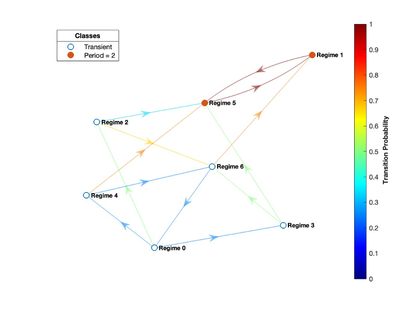

# Markov Processes - States and Classes

## Overview

This project is part of the Computational Mathematics II course in the Master's Program. The aim is to study Markov processes, specifically focusing on identifying the types of states and recurrent classes within a Markov chain using Python.

## Markov Processes

A Markov process is a mathematical model used to describe a sequence of events or states, where the probability of transitioning from one state to another depends only on the current state and is independent of the previous states. This property is known as the Markov property or the memoryless property.

## Markov Chains

A Markov chain is a specific type of Markov process that operates in discrete time steps. In a Markov chain, each state can either be recurrent or transient. A state is recurrent if, once left, it will be revisited with probability one. Conversely, if the probability of return is less than one, the state is considered transient.

### Transition Matrix

To study the evolution of such systems over time, a transition matrix is used, where each element \( p_{ij} \) represents the probability of transitioning from state \( i \) to state \( j \). This matrix is square, and the sum of the elements in each row must equal one.

## Analysis Methodology

### Graph Representation

The transition matrix is transformed into a directed graph where each node represents a state and each directed edge represents a possible transition between states. This graph-based representation facilitates the identification of cycles and paths within the Markov chain.

### Depth-First Search (DFS)

Depth-First Search (DFS) is a fundamental algorithm in computer science used to traverse or search tree or graph data structures. Starting from a root node, DFS explores as far as possible along each branch before backtracking, making it a powerful tool for detecting cycles in graphs.

#### Application in Markov Analysis

1. **Cycle Detection**: In this project, DFS is employed to detect cycles within the graph representation of the Markov chain. A cycle indicates a set of states that are recurrent.
2. **Recurrence Identification**: By identifying cycles, DFS helps classify states into recurrent classes. States that are part of a cycle are recurrent, while those that are not are transient.
3. **Complexity and Efficiency**: DFS is chosen for its efficiency in handling large graphs. It systematically explores nodes, making it suitable for the analysis of state transitions in Markov chains.

### Tree Data Structures and DFS

DFS is particularly well-suited for tree data structures due to its ability to explore all possible paths from the root to the leaves. In a tree, DFS can be used to perform various tasks such as:

1. **Tree Traversal**: Visiting all nodes in the tree.
2. **Path Finding**: Finding paths from the root to any node or between any two nodes.
3. **Subtree Analysis**: Analyzing specific subtrees or branches within the larger tree.

In the context of Markov processes, although the primary structure is a graph, the principles of DFS applied to tree traversal provide a foundation for understanding state transitions and recurrent structures.

### Recurrent Classes and Transient States

States forming cycles are grouped into recurrent classes. These classes are sets of states where each state can be revisited from any other state within the same class. States not involved in any cycle are identified as transient states.

## Results

For the given 7x7 transition matrix, the results are:

- **Recurrent Classes**:
  - Recurrent Class 1: ['1', '5']

- **States**:
  - Transient states: ['0', '2', '3', '4', '6']
  - Recurrent states: ['1', '5']

  ## Transition Graph

## Practical Applications of Markov Analysis

Markov chains and processes are widely used in various fields due to their ability to model random systems with memoryless properties. Some practical applications include:

1. **Finance**: Modeling stock prices and market behaviors to predict future trends.
2. **Queueing Theory**: Analyzing customer service processes in banks, supermarkets, and call centers to optimize service efficiency.
3. **Natural Language Processing**: Implementing text prediction and autocomplete features in search engines and messaging apps.
4. **Genetics**: Studying the sequence of genes and their mutations over generations.
5. **Weather Forecasting**: Predicting weather patterns based on current conditions.
6. **Internet Page Ranking**: Google's PageRank algorithm uses Markov chains to rank web pages in search results.

## Conclusion

This project demonstrates the application of Markov processes in identifying state types and recurrent classes. The code successfully identifies recurrent and transient states, validating the transition matrix and the recurrent classes within a Markov chain. Understanding these concepts and their applications provides a strong foundation for analyzing and interpreting systems governed by stochastic processes.
